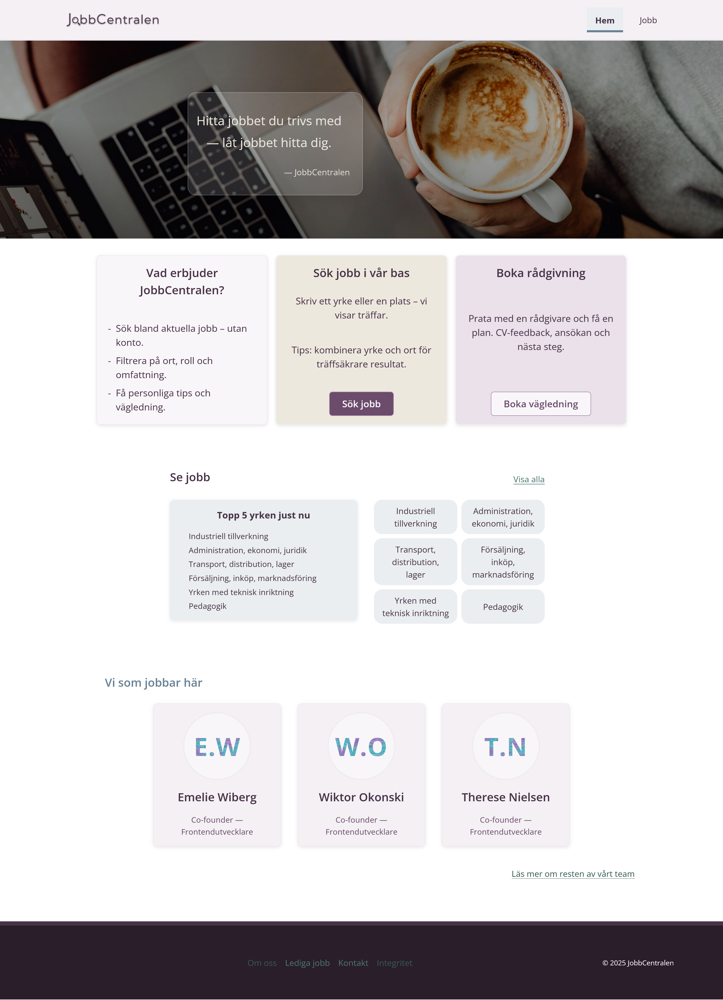
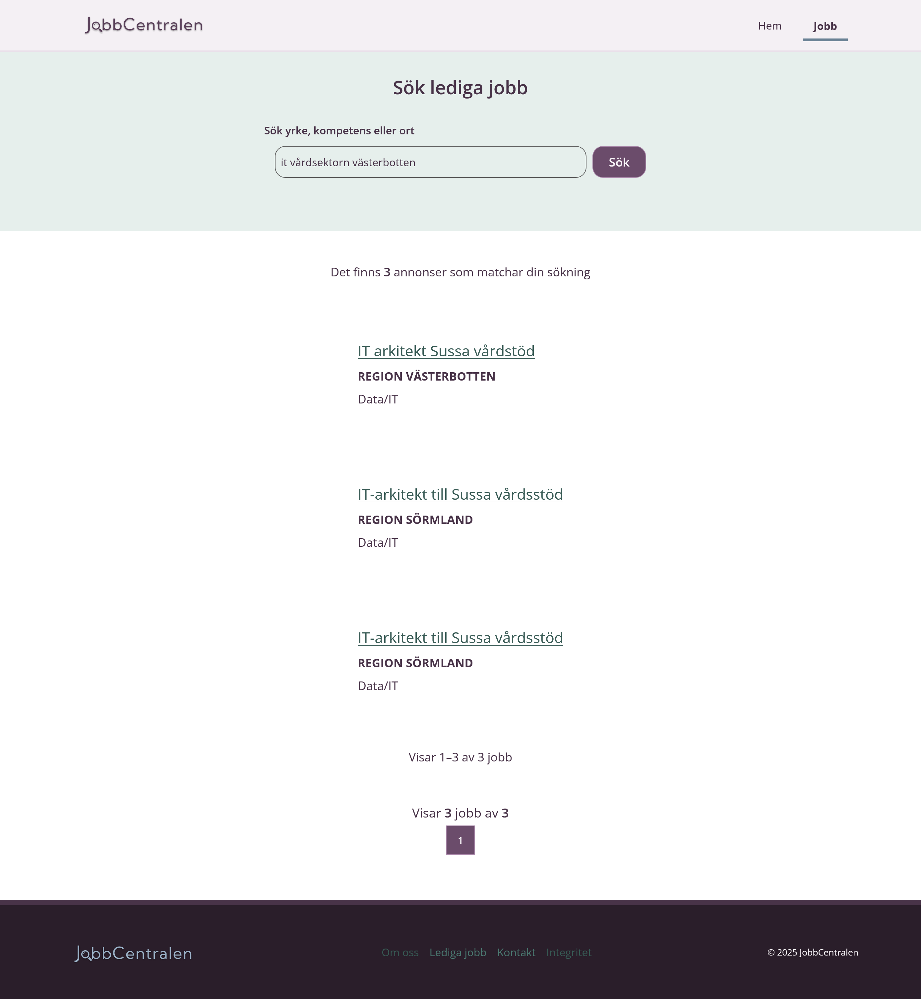
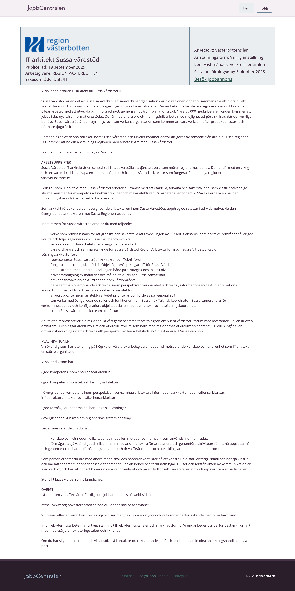

# 🎯 Project Goal

Build a modern, customized version of **Platsbanken** (Sweden's job listing platform) using real-time and historical job data from **Arbetsförmedlingen’s open data APIs**. The application provides a clean, responsive interface to explore job listings and gain insights through visualizations.

This project is intended as a **student case study** to practice API integration, data presentation, and frontend development using modern React tools and methodologies.

---

## 🧠 Why We're Doing This

- Gain hands-on experience with **public APIs** and **real data**  
- Apply **React principles**: state management, routing, context  
- Explore **data visualization** (charts, graphs)  
- Implement a professional **design system**  
- Build reusable components and **custom hooks**

---

## 🧰 Tech Stack

- **React** (hooks, context, routing)  
- **Fetch** for API calls  
- **Styled Components** (optional)  
- **Arbetsförmedlingen Design System**  
  https://designsystem.arbetsformedlingen.se/  
- **Arbetsförmedlingen’s APIs**  
  - [`/search`](https://jobsearch.api.jobtechdev.se/) – real-time job listings  
  - [`/historical`](https://historical.api.jobtechdev.se/) – historical job data

**Client badges**  

---

## 📸 Screenshots

### Homepage

- Clear hero with tagline  
- Quick actions (search, guidance)  
- Top occupations overview

### Jobs (Listings)

- Free-text search with suggestions  
- Paged results with key job info  
- Simple, readable card layout

### Single Ad (Details)

- Full job description + employer  
- Apply CTA and external link  
- Metadata: location, extent, posted date

---

## 👤 Authors

- [@Wiktor Okonski](https://github.com/PotoVic)  
- [@Therese Nielsen](https://github.com/thnielseen)  
- [@Emelie Wiberg](https://github.com/Erm0es)
